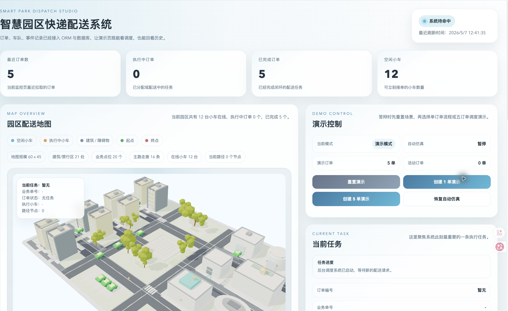

# 智慧园区快递配送系统

这是一个面向毕业设计展示的智慧园区快递配送系统。

项目用一个“调度驾驶舱”串起完整业务链：用户创建配送订单，后端根据园区道路、小车位置、电量和近期任务情况自动选择车辆，通过 A* 算法规划路径，再持续推进小车移动，并把订单状态、调度过程和事件历史记录到数据库中。



## 项目现在能做什么

- 展示智慧园区 3D 调度沙盘，地图上能看到道路、建筑、业务点位、配送小车和当前路径。
- 地图是页面主视觉，顶部是紧凑系统状态栏，右侧模块放不下时会自动流到地图下方。
- 调度控制台、当前任务、调度解释、车队状态、系统日志、订单历史、创建订单都支持收起、展开和拖拽排序。
- 支持手动创建订单，选择真实园区业务点作为起点，输入楼栋或地址作为终点。
- 提供演示控制能力，答辩时可以重置场景、创建 1 单演示、创建 5 单并行演示、恢复自动仿真。
- 后台自动扫描待配送订单，按综合成本为订单分配小车。
- 使用 A* 算法在园区网格中规划路径，避开建筑、禁行区和不可通行区域。
- 小车会沿路径逐步移动，订单状态会从待调度推进到已分配、配送中、已完成。
- 记录订单事件时间线，支持在订单历史中回看配送过程。
- 展示调度解释，说明候选小车为什么被选中或被排除。
- 3D 地图鼠标控制加入轻微惯性和阻尼，旋转、平移、缩放更接近真实调度沙盘的手感。

## 核心业务流程

```text
创建订单
  ↓
保存订单、起终点和订单事件
  ↓
后台调度器扫描待处理订单
  ↓
计算候选小车到取件点、取件点到送达点的路径
  ↓
结合空驶距离、电量、近期接单次数计算综合成本
  ↓
选择综合成本最低且路径可达的小车
  ↓
保存分配结果和调度解释
  ↓
后台线程推动小车沿路径移动
  ↓
订单状态、车辆状态和事件日志持续更新
  ↓
前端轮询接口并刷新驾驶舱
```

这条链路是项目的主线。页面布局、数据库设计和调度逻辑都是围绕它展开的。

## 技术栈

### 前端

- Vue 3
- Vite
- Composition API
- Three.js
- 原生 Drag and Drop
- ResizeObserver
- localStorage

### 后端

- Flask
- Flask-SQLAlchemy
- Flask-Migrate
- SQLAlchemy
- Alembic

### 数据库

- SQLite

## 项目结构

```text
GraduationProject/
├── app.py                         # 根启动入口，保留 python app.py 的启动方式
├── backend/
│   ├── app.py                     # Flask 应用创建、扩展初始化、接口注册
│   ├── api/                       # HTTP 接口和前端页面托管
│   ├── business/                  # 订单、调度、小车、演示等业务逻辑
│   ├── campus/                    # 园区规则读取和 A* 路径规划
│   ├── database/                  # ORM 模型
│   └── system/                    # 配置、数据库扩展、运行时状态、调度线程
├── frontend/
│   ├── index.html                 # 浏览器标题和 favicon 入口
│   ├── public/                    # favicon、预览图和 3D 静态资源
│   └── src/
│       ├── api/                   # 前端请求封装
│       ├── campus/                # Three.js 场景、相机控制和业务地图配置
│       ├── dashboard/             # 驾驶舱页面、模块、面板和状态整理逻辑
│       └── styles/                # 全局样式和组件样式
├── shared/
│   └── campus_rules.json          # 前后端共用的园区业务规则
├── migrations/                    # 数据库迁移文件
└── requirements.txt               # Python 依赖
```

## 关键设计

### 1. 园区规则统一

园区地图不是前端和后端各写一份。

[shared/campus_rules.json](./shared/campus_rules.json) 统一保存地图尺寸、建筑禁行区、道路、业务点位、默认小车和演示订单。后端通过 [backend/campus/rules.py](./backend/campus/rules.py) 读取规则，前端基于同一套业务点位展示 3D 地图和订单信息。

这样做的好处是：地图展示、路径规划和演示订单使用同一份事实来源，不容易出现前端能看到、后端却无法通行的问题。

### 2. 后端按职责分层

后端当前分成四层：

- [backend/api/](./backend/api/)：接收 HTTP 请求，返回 JSON 或前端页面。
- [backend/business/](./backend/business/)：处理订单创建、调度分配、小车移动、演示重置等业务逻辑。
- [backend/campus/](./backend/campus/)：读取园区规则并执行路径规划。
- [backend/database/](./backend/database/)：定义订单、小车、点位和事件记录等 ORM 模型。

这样比把所有逻辑塞进 Flask 路由函数里更清楚，也方便答辩时按“接口层、业务层、数据层”讲解。

### 3. 调度策略简单但可解释

当前调度策略不是单纯“最近小车优先”，而是综合评分：

```text
综合成本 = 空驶距离 + 低电量惩罚 + 近期接单惩罚 - 长期未使用奖励
```

调度过程会：

1. 找出待调度订单。
2. 遍历全部小车。
3. 跳过正在执行任务的小车。
4. 分别计算小车到取件点、取件点到送达点的路径。
5. 排除路径不可达或电量不足的小车。
6. 按综合成本选择最合适的小车。
7. 保存候选小车对比结果，供前端展示调度解释。

这个策略的优点是规则清楚、结果可验证，也比单纯距离排序更符合“车队调度”的业务表达。

### 4. 驾驶舱模块是一个统一列表

页面入口是 [frontend/src/dashboard/DashboardView.vue](./frontend/src/dashboard/DashboardView.vue)。

当前驾驶舱不再人为区分“右侧区”和“底部区”。所有模块只维护一个全局顺序：

- 调度控制台
- 当前任务
- 调度解释
- 车队状态
- 系统日志
- 订单历史
- 创建订单

[useDashboardModuleLayout.js](./frontend/src/dashboard/composables/useDashboardModuleLayout.js) 会根据地图卡片高度自动计算模块位置：桌面端优先放到地图右侧，右侧放不下的模块自动流到地图下方；窄屏端全部自然排到地图下方。

模块外壳由 [DashboardModuleShell.vue](./frontend/src/dashboard/components/layout/DashboardModuleShell.vue) 统一负责标题、摘要、收起展开和拖拽排序。模块顺序和展开状态会保存到 `localStorage`，刷新后仍然保留。

### 5. 前端数据先整理再展示

驾驶舱的数据逻辑主要收敛在 [useDashboardData.js](./frontend/src/dashboard/composables/useDashboardData.js)：

- 轮询订单、小车、演示状态和调度解释。
- 整理顶部系统状态栏。
- 选出当前任务。
- 生成订单历史、车队状态和系统日志。
- 把后端原始状态翻译成页面可读的中文。

地图面板 [ParkMap.vue](./frontend/src/dashboard/components/map/ParkMap.vue) 只负责承载 3D 地图、小车、路径、起终点和地图说明。

### 6. 3D 地图交互带轻微惯性

3D 场景相关逻辑集中在 [frontend/src/campus/](./frontend/src/campus/)：

- [useThreeCampusPrototype.js](./frontend/src/campus/useThreeCampusPrototype.js)：创建 Three.js 场景、加载模型、驱动动画循环。
- [threeCameraControls.js](./frontend/src/campus/threeCameraControls.js)：处理鼠标左键旋转、右键平移、滚轮缩放。
- [campusSceneConfig.js](./frontend/src/campus/campusSceneConfig.js)：统一管理镜头、模型、业务锚点和惯性参数。

相机控制使用自定义“速度 + 阻尼”模型。鼠标停止后，旋转、平移和缩放会继续轻微衰减一小段时间，避免画面突然停住。

## 快速启动

### 1. 安装后端依赖

```bash
pip install -r requirements.txt
```

### 2. 安装并构建前端

```bash
cd frontend
npm install
npm run build
cd ..
```

### 3. 启动项目

```bash
python app.py
```

访问地址：

```text
http://127.0.0.1:5001
```

后端会托管 `frontend/dist`，所以改了前端页面后需要重新执行 `npm run build`。

## 开发时常用命令

只改后端时：

```bash
python app.py
```

前后端分开开发时，可以开两个终端：

```bash
python app.py
```

```bash
cd frontend
npm run dev
```

Vite 开发服务会把 `/api` 请求代理到 `http://127.0.0.1:5001`。

改完前端并准备由 Flask 统一访问时：

```bash
cd frontend
npm run build
cd ..
python app.py
```

生成数据库迁移：

```bash
flask --app app db migrate -m "描述这次表结构变化"
flask --app app db upgrade
```

## 数据库说明

项目默认使用 SQLite，数据库文件位于：

```text
data/project.db
```

主要模型：

- [Cart](./backend/database/cart.py)：配送小车，记录状态、当前位置、电量、当前路径和任务。
- [Order](./backend/database/order.py)：订单主表，记录订单编号、状态、来源、分配小车和路径。
- [OrderPoint](./backend/database/order_point.py)：订单起点和终点。
- [OrderEvent](./backend/database/order_event.py)：订单事件时间线。

数据库运行文件不应该提交到仓库，迁移文件和模型代码才是需要保留的内容。

## 推荐阅读顺序

如果是第一次看这个项目，建议按这个顺序读：

1. [shared/campus_rules.json](./shared/campus_rules.json)：先理解园区世界规则。
2. [backend/campus/pathfinding.py](./backend/campus/pathfinding.py)：看路径是怎么规划出来的。
3. [backend/database/](./backend/database/)：理解系统需要保存哪些数据。
4. [backend/business/order.py](./backend/business/order.py)：看订单如何创建和记录事件。
5. [backend/business/dispatch.py](./backend/business/dispatch.py)：看小车如何接单、评分和移动。
6. [frontend/src/dashboard/composables/useDashboardData.js](./frontend/src/dashboard/composables/useDashboardData.js)：看前端如何整理后端数据。
7. [frontend/src/dashboard/composables/useDashboardModuleLayout.js](./frontend/src/dashboard/composables/useDashboardModuleLayout.js)：看驾驶舱模块如何自动布局和拖拽排序。
8. [frontend/src/campus/useThreeCampusPrototype.js](./frontend/src/campus/useThreeCampusPrototype.js)：看 3D 场景如何创建和更新。
9. [frontend/src/dashboard/DashboardView.vue](./frontend/src/dashboard/DashboardView.vue)：最后看页面如何组织各个模块。

## 后续可以扩展什么

- 订单取消和重新调度。
- 小车离线、维护、载重等状态。
- 多种调度策略对比，例如最近距离、最少任务、优先级订单。
- 订单统计图表，例如完成时长、每日订单量、小车利用率。
- 独立订单详情页。
- 更完整的权限和后台管理页面。
