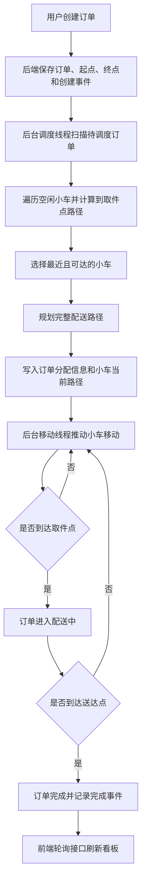
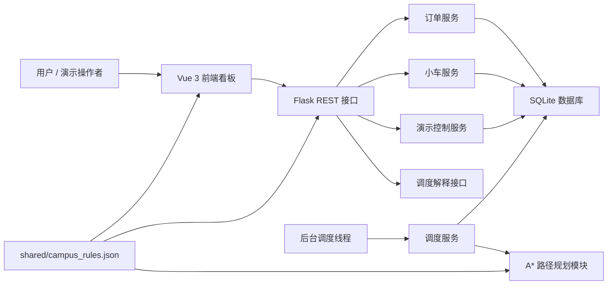
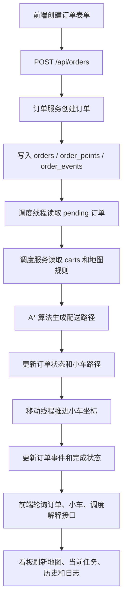
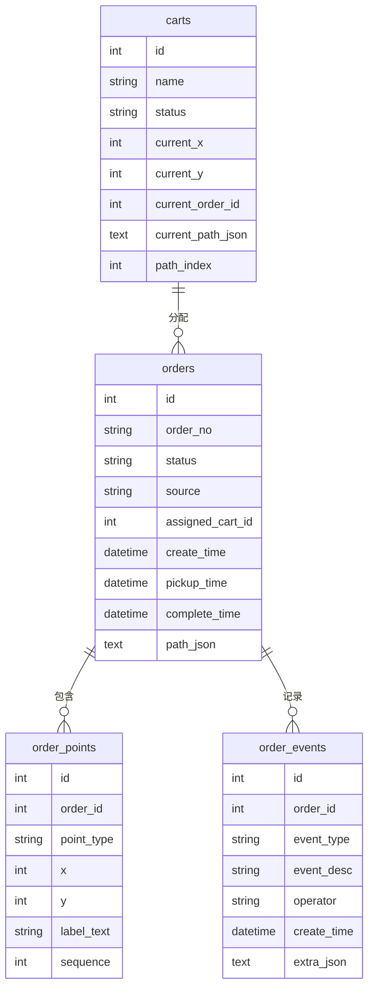
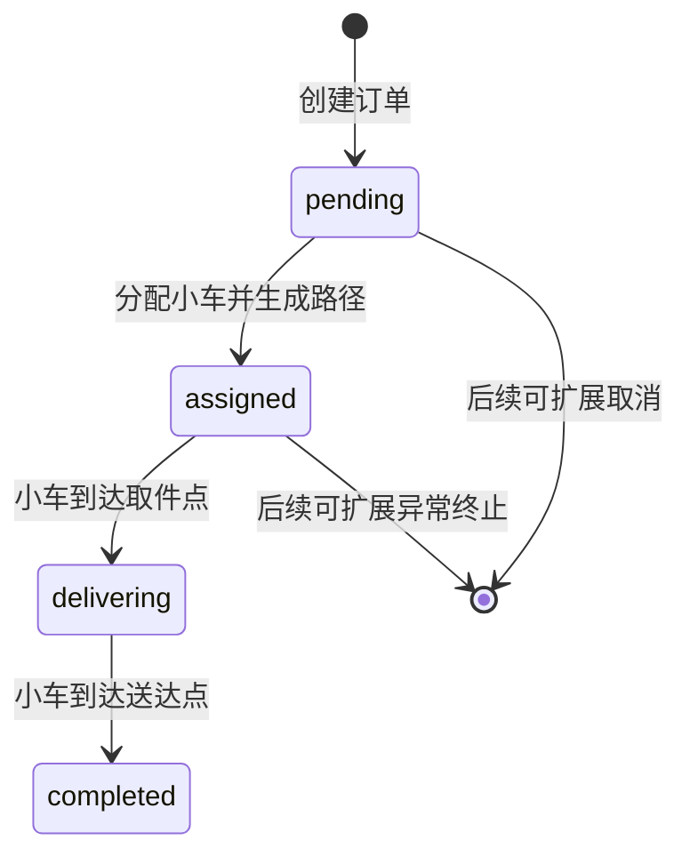
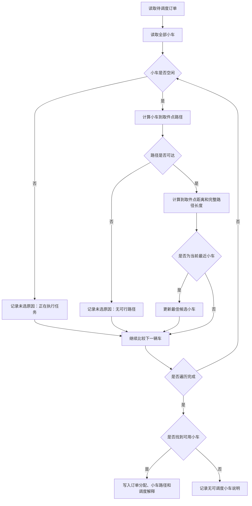
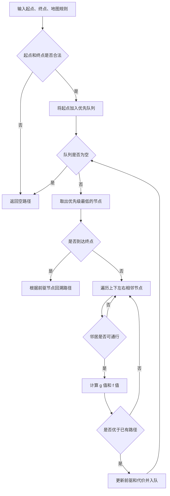
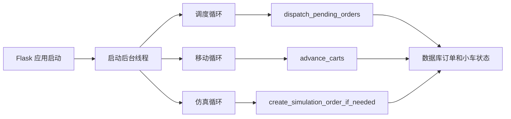
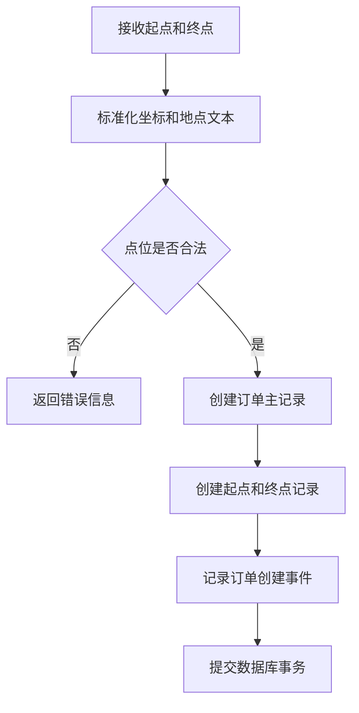

# 《智慧园区快递配送系统的设计与实现》论文正文草稿

## 协作规则

- 本文件作为论文正文的长期草稿，不直接频繁生成 Word 文档。
- 每次优先只修改一个章节或一个小节，方便检查和回退。
- 正文按本科毕业设计论文风格撰写：正式、清楚、贴合项目，不写空泛套话。
- 所有内容必须符合当前项目真实情况，不虚构未实现功能。
- 最后定稿后，再统一整理格式、目录、参考文献，并导出为 `.docx`。

## 写作主线

本论文围绕智慧园区快递配送系统展开，主线为：

订单创建 → 自动调度 → A* 路径规划 → 小车状态推进 → 订单事件回放 → Three.js 可视化看板

## 论文目录

### 摘要

随着智慧园区建设和快递配送需求的发展，园区内配送任务逐渐呈现出点位分散、状态变化频繁和调度过程不透明等特点。针对传统人工配送管理中存在的配送状态难以追踪、路径规划不直观、调度过程缺少可解释性等问题，本文设计并实现了一套智慧园区快递配送系统。

系统采用前后端分层架构，前端基于 Vue 3 和 Three.js 实现可视化看板，后端基于 Flask 提供订单、小车、调度和演示控制接口，数据库采用 SQLite 保存订单、小车、点位和事件数据。系统以园区统一地图规则为基础，使用 A* 算法完成小车路径规划，采用最近空闲车优先策略完成订单调度，并通过后台线程持续推进小车移动和订单状态变化。前端看板能够展示园区地图、当前任务、订单历史、车队状态、系统日志和调度解释，使配送过程能够被直观观察和回放。

测试结果表明，系统能够完成从订单创建、自动调度、路径规划、小车移动到订单完成的基本业务闭环，具备较好的演示效果和一定的扩展能力。该系统能够为智慧园区快递配送信息化管理提供一种简单、清晰、可解释的实现方案。

**关键词：**智慧园区；快递配送；路径规划；自动调度；可视化系统

**Abstract**

With the development of smart parks and express delivery services, delivery tasks in park scenarios are becoming increasingly distributed, dynamic, and difficult to monitor manually. To address the problems of unclear delivery status, unintuitive path planning, and insufficient interpretability in traditional delivery management, this thesis designs and implements a smart park express delivery system.

The system adopts a layered front-end and back-end architecture. The front end uses Vue 3 and Three.js to build a visual dashboard, while the back end uses Flask to provide interfaces for orders, carts, dispatching, and demonstration control. SQLite is used to store order, cart, point, and event data. Based on unified park map rules, the system uses the A* algorithm for path planning and adopts a nearest-idle-cart-first strategy for order dispatching. Background threads continuously advance cart movement and update order status. The front-end dashboard displays the park map, current task, order history, fleet status, system logs, and dispatch explanations, making the delivery process observable and traceable.

Test results show that the system can complete the basic business process from order creation, automatic dispatching, path planning, cart movement, to order completion. The system has good demonstration effects and certain extensibility, and provides a simple, clear, and interpretable implementation scheme for express delivery management in smart park scenarios.

**Keywords:** Smart Park; Express Delivery; Path Planning; Automatic Dispatching; Visualization System

### 第 1 章 绪论

#### 1.1 研究背景

随着电子商务、即时配送和园区数字化管理的发展，快递配送已经成为高校园区、产业园区和社区园区中较为常见的日常服务。传统园区快递配送通常依赖人工分拣、人工派送和线下沟通，虽然实现方式简单，但在订单数量增加、配送点位分散、配送路径复杂时，容易出现配送效率不稳定、任务状态不透明、调度过程难以追踪等问题。对于管理者而言，缺少一个能够直观展示订单、车辆、路径和配送状态的系统，也会影响日常管理和问题排查。

智慧园区建设的核心目标之一，是通过信息化手段提升园区运行效率。快递配送虽然只是园区服务中的一个具体场景，但它同时涉及订单管理、路径规划、车辆调度、状态更新和数据可视化，能够较好地体现智慧园区系统中“数据驱动业务运行”的特点。因此，围绕园区快递配送建立一个可演示、可解释、可扩展的系统，既具有一定的实际意义，也适合作为毕业设计项目进行完整实现。

本课题以智慧园区内的快递配送业务为研究对象，设计并实现一个智慧园区快递配送系统。系统通过前端可视化看板展示园区地图、订单状态、车队状态和配送路径；通过后端服务完成订单创建、自动调度、路径规划和状态推进；通过数据库记录订单、车辆和事件数据。系统的重点不是简单完成订单增删改查，而是将“订单创建、自动调度、A* 路径规划、小车移动、状态回放和可视化展示”串联成一条完整的业务链路。

#### 1.2 研究意义

本课题的研究意义主要体现在以下几个方面。

首先，从业务应用角度看，系统能够模拟园区快递从创建订单到完成配送的完整过程。通过对订单状态、小车位置和配送路径的统一管理，系统可以让配送过程更加清晰，减少传统人工管理中信息分散、状态不明确的问题。即使本系统目前主要面向毕业设计演示，也能够反映园区快递配送信息化管理的基本思路。

其次，从系统设计角度看，本课题将前端可视化、后端业务服务、数据库建模、路径规划算法和后台调度线程结合在一起。相比只实现单一页面或单一接口的项目，该系统更强调模块之间的协作关系。订单服务负责订单创建和状态记录，调度服务负责车辆选择和路径分配，路径规划模块负责根据园区地图计算可行路线，前端看板负责把业务状态转换为直观的可视化结果。这种设计有助于提升系统的结构清晰度和可维护性。

再次，从学习和展示角度看，本课题适合用于毕业设计答辩展示。系统可以通过演示订单展示调度过程，通过地图展示小车移动路径，通过订单事件展示状态变化过程。相比只展示静态页面，完整的业务闭环更容易说明系统的设计思路和实现价值，也更方便展示项目中的关键技术点。

#### 1.3 国内外研究现状

从国内外相关研究和工程应用来看，智慧物流、路径规划和配送调度一直是物流信息系统中的重要方向。随着物联网、人工智能和数据分析技术的发展，智慧物流逐渐从单纯的信息记录转向自动感知、智能决策和过程优化[9-11]。在实际物流场景中，自动化仓储、无人配送车、智能分拣和路径优化等技术已经得到较多关注。大型物流企业通常会结合订单数据、车辆数据和地理信息系统，对配送任务进行智能分配和路线优化，以提升配送效率并降低运营成本。

在路径规划方面，常见算法包括 Dijkstra 算法、A* 算法、遗传算法、蚁群算法等。其中，Dijkstra 算法适合求解无启发信息条件下的最短路径[1]，A* 算法则在搜索过程中引入启发函数，能够在网格地图等场景中更快地向目标点搜索[2]。遗传算法和蚁群算法也常用于旅行商问题、车辆路径问题等组合优化场景[12-13]。近年来，最短路径算法在理论研究层面仍在持续发展，例如清华大学相关研究团队提出的新型单源最短路径算法，在非负边权有向图场景下突破了 Dijkstra 算法长期存在的排序瓶颈，体现了最短路径问题在算法复杂度研究上的进一步推进[3]。但对于小区或园区配送这类应用场景，地图规模通常较小，路径规划更关注障碍物避让、实现稳定性和搜索过程的可解释性。因此，本文未采用该类偏理论优化的最短路径算法，而是选择结构清晰、适合网格地图搜索的 A* 算法作为系统路径规划方案。

在配送调度方面，研究内容通常包括车辆路径问题、多车辆协同调度、订单优先级分配和动态任务调整等。车辆路径问题最早可追溯到货车调度问题，之后逐渐发展出节约算法、带时间窗车辆路径问题、动态车辆路径问题等多个研究方向[14-19]。复杂调度模型往往需要考虑车辆容量、配送时间窗、实时交通状况和多目标优化等因素。相比真实物流系统，本课题面对的是毕业设计演示场景，系统规模较小，配送点位和车辆数量有限，因此采用“最近空闲车优先”的调度策略更符合当前项目目标。该策略虽然不是最复杂的调度算法，但具有规则直观、结果可解释、实现稳定的优点，便于在系统中展示调度依据。

在系统可视化方面，国内外许多物流管理系统都会通过地图、状态面板和数据统计展示订单运行情况。可视化的价值不只是让页面更美观，更重要的是降低理解业务状态的成本。对于园区配送系统而言，地图能够展示建筑、道路、服务点和车辆位置，状态面板能够展示订单进度、车队情况和系统日志。基于这些现状，本课题将 Three.js 场景展示与 Vue 前端看板结合，用于呈现园区地图和配送过程。

总体来看，现有研究和应用为本课题提供了较成熟的技术基础，但大型物流系统通常规模较大、模型复杂，不适合直接照搬到毕业设计项目中。因此，本课题更关注在可控规模内实现一条清楚的业务闭环，在保证系统能运行、能演示、能讲解的基础上，完成适合本项目规模的系统设计与实现。

#### 1.4 研究内容

本文围绕智慧园区快递配送系统的设计与实现展开，主要研究和实现内容如下。

第一，完成园区快递配送业务流程分析。根据园区配送场景，将系统业务流程划分为订单创建、订单保存、车辆调度、路径规划、小车移动、订单状态更新和事件记录等环节，并以此作为系统设计和实现的主线。

第二，完成系统总体架构设计。系统采用前后端分离的设计思路，前端使用 Vue 3 和 Three.js 实现可视化看板，后端使用 Flask 提供业务接口，数据库使用 SQLite 保存订单、小车和事件信息。同时，系统通过共享园区规则配置统一前端展示和后端路径规划所使用的地图数据。

第三，完成订单管理和状态流转功能。系统支持创建配送订单，保存订单起点、终点、来源和备注信息，并记录订单创建、分配、配送中、完成等关键事件。通过订单状态流转，系统能够反映配送任务从生成到完成的全过程。

第四，完成自动调度和路径规划功能。后端调度服务定期扫描待处理订单，遍历当前小车状态，选择最近且可达的空闲小车执行配送任务。路径规划模块基于 A* 算法，在园区网格地图中计算小车到取件点以及取件点到送达点的完整路径。

第五，完成前端可视化展示功能。前端看板展示园区地图、当前任务、订单历史、车队状态、系统日志和调度解释等信息。系统通过轮询接口获取最新数据，并将后端原始状态整理为用户易理解的页面信息，使配送过程能够被直观看到。

第六，完成系统测试与演示验证。通过创建订单、自动调度、路径规划、小车移动、状态更新和订单历史回放等测试，验证系统核心功能是否能够稳定运行，并检查系统是否满足毕业设计演示需求。

#### 1.5 论文组织结构

本文共分为八章，各章内容安排如下。

第 1 章为绪论，主要介绍课题研究背景、研究意义、国内外研究现状、研究内容以及论文整体结构。

第 2 章为相关技术介绍，主要介绍系统开发过程中使用的 Vue 3、Flask、SQLite、A* 路径规划算法和 Three.js 可视化技术，为后续系统设计与实现提供技术基础。

第 3 章为系统需求分析，主要从园区快递配送业务场景出发，分析系统用户角色、使用场景、功能需求和非功能需求，并梳理系统核心业务流程。

第 4 章为系统总体设计，主要说明系统整体架构、前后端分层方式、核心功能模块、园区地图规则设计和系统数据流设计。

第 5 章为系统详细设计，主要对数据库表结构、订单状态流转、自动调度策略、A* 路径规划、后台调度线程、前端看板交互和 3D 园区地图可视化进行详细说明。

第 6 章为系统实现，主要结合具体项目实现，说明后端接口、订单服务、小车调度服务、路径规划功能、前端数据轮询、地图展示和演示控制等功能的实现过程。

第 7 章为系统测试，主要介绍测试环境、功能测试、调度场景测试、可视化展示测试和测试结果分析，验证系统是否满足预期目标。

第 8 章为总结与展望，主要总结本文完成的工作，分析系统当前存在的不足，并对后续可扩展方向进行展望。

### 第 2 章 相关技术介绍

#### 2.1 Vue 3 与前端组件化开发

Vue 是一种用于构建用户界面的 JavaScript 框架，具有声明式渲染、响应式数据绑定和组件化开发等特点[4]。在前端系统开发中，组件化思想可以将复杂页面拆分为多个相对独立的功能模块，每个组件负责一部分明确的界面展示或交互逻辑，从而降低页面维护成本。

本系统前端采用 Vue 3 实现智慧园区配送看板。看板页面不是把所有界面和逻辑都写在同一个文件中，而是按照功能拆分为地图组件、顶部状态栏、当前任务面板、订单创建面板、订单历史面板、车队状态面板和系统日志面板等。页面入口主要负责组织这些组件，具体数据获取、状态整理和业务展示逻辑则进一步放入组合式函数中。这样做可以让页面结构更加清晰，也便于后续继续扩展新的面板或调整展示布局。

Vue 3 的 Composition API 适合将相关状态和方法收敛在同一组逻辑中。本项目中的前端数据轮询、订单筛选、当前任务选择、日志生成和演示控制等逻辑，集中封装在看板数据组合式函数中。组件只需要接收整理后的数据并完成展示，避免页面模板中混入过多业务处理代码。对于毕业设计项目而言，这种组织方式既能保持代码可读性，也方便在论文和答辩中解释前端模块之间的关系。

此外，本项目使用 Vite 作为前端构建工具。Vite 在开发阶段可以提供较快的启动和热更新体验，在生产阶段则负责将 Vue 页面打包成静态资源。后端 Flask 应用在运行时托管前端打包产物，使系统可以通过同一个 Web 服务入口访问页面和接口。

#### 2.2 Flask 后端 Web 服务

Flask 是 Python 生态中常用的轻量级 Web 框架，官方文档将其定位为轻量级 WSGI Web 应用框架，适合快速构建 Web 服务，并能够根据项目需要逐步扩展[5]。对于本课题这种毕业设计系统，Flask 的优势在于结构简单、上手成本低、接口开发直观，能够较好地满足订单、小车、调度和演示控制等后端接口需求。

本系统后端使用 Flask 负责应用初始化、接口注册、静态资源托管和 JSON 数据返回。系统提供的主要接口包括订单列表查询、订单创建、订单详情查询、订单事件查询、小车状态查询、调度解释查询、演示场景重置和演示订单创建等。前端通过这些接口获取订单、小车、路径和调度状态，从而保持看板数据更新。

在后端结构上，本项目没有把全部业务逻辑都直接写在路由函数中。路由层主要负责接收请求参数、调用服务层方法并返回响应结果；订单创建、订单查询、调度分配、小车状态维护和演示控制等业务逻辑则放在 `backend/services/` 目录下。这样的分层方式可以减少路由文件的复杂度，使业务代码更容易阅读和维护。

Flask 后端还承担前端页面托管职责。系统在访问根路径时返回前端构建后的页面文件，在访问接口路径时返回 JSON 数据。这种方式可以简化毕业设计项目的部署流程，使演示时只需要启动一个后端服务，就能同时访问系统页面和业务接口。

#### 2.3 SQLite 与 ORM 数据建模

数据库是系统保存业务状态的重要基础。本系统需要持久化保存订单、小车、订单点位和订单事件等数据。如果只将这些数据保存在内存中，系统重启后业务状态会丢失，也不利于回放订单处理过程。因此，项目使用 SQLite 作为数据库，并通过 SQLAlchemy ORM 完成数据模型定义和数据库操作。

SQLite 是一种轻量级关系型数据库，具有部署简单、无需单独数据库服务器、适合中小规模应用和本地文件存储等特点[6]。对于毕业设计演示系统而言，SQLite 可以降低环境配置复杂度，避免额外安装和维护独立数据库服务。系统中的数据库文件保存在项目数据目录中，便于开发、测试和演示。

ORM 即对象关系映射，用于在程序对象和数据库表之间建立对应关系。SQLAlchemy ORM 支持通过 Python 类描述数据表结构，并通过对象方式完成查询、插入和更新等操作[7]。本系统使用 Flask-SQLAlchemy 将 SQLAlchemy 与 Flask 应用集成起来，使后端服务可以通过模型类操作数据库。

本项目的核心数据模型包括订单模型、订单点位模型、订单事件模型和配送小车模型。订单模型保存订单编号、订单状态、订单来源、分配小车、创建时间、完成时间和路径信息；订单点位模型保存订单起点和终点坐标；订单事件模型保存订单创建、分配、配送中和完成等关键事件；配送小车模型保存小车名称、当前位置、运行状态、当前订单和当前路径。通过这些模型，系统能够记录配送业务从创建到完成的完整过程。

为了便于后续维护，项目使用 Flask-Migrate 和 Alembic 管理数据库迁移。当模型结构发生变化时，可以通过迁移文件记录表结构变化，使数据库结构和代码模型保持一致。这对于毕业设计后期修改字段、调整模型和补充功能具有实际意义。

#### 2.4 A* 路径规划算法

A* 算法是一种常见的启发式路径搜索算法，最早由 Hart、Nilsson 和 Raphael 提出[2]。与只根据已知路径代价进行搜索的算法相比，A* 算法在搜索过程中加入了对目标方向的估计，因此在许多地图路径规划和运动规划场景中具有较好的搜索效率[20]。

A* 算法通常使用评价函数：

```text
f(n) = g(n) + h(n)
```

其中，`g(n)` 表示从起点到当前节点 `n` 的实际代价，`h(n)` 表示从当前节点到目标节点的估计代价，`f(n)` 则用于判断节点的综合优先级。当启发函数设计合理时，算法可以在保证路径正确性的同时，减少不必要的搜索范围。

在本系统中，园区地图被抽象为二维网格。每个网格点表示一个可判断的位置，建筑、绿化、广场等不可通行区域被视为障碍物或非车辆可达区域。由于小车在当前设计中按照上下左右四个方向移动，因此路径规划采用曼哈顿距离作为启发函数，即通过横向距离与纵向距离之和估计当前点到目标点的距离。

后端路径规划模块接收起点、终点、地图边界、障碍物和可通行点集合等参数。算法首先检查起点和终点是否合法，如果起点或终点越界、落在障碍物中或不属于车辆可达区域，则直接返回空路径。搜索过程中，系统使用优先队列保存待扩展节点，并记录每个节点的前驱节点和当前最短代价。当搜索到终点后，再根据前驱关系回溯生成完整路径。最终路径以坐标数组形式返回，既可以供调度服务保存，也可以供前端地图展示。

选择 A* 算法的原因主要有三点。第一，园区地图规模较小，A* 算法已经能够满足系统实时演示需求。第二，A* 算法逻辑清楚，便于解释路径是如何绕开建筑和禁行区生成的。第三，A* 算法与网格地图结合紧密，适合当前项目中二维园区规则和 Three.js 可视化场景之间的数据衔接。

#### 2.5 Three.js 可视化技术

Three.js 是一个基于 JavaScript 的三维图形库，封装了场景、相机、几何体、材质、光照、渲染器和交互控制等常用能力，开发者可以在浏览器中构建 Web 端三维可视化效果[8]。相比直接使用底层 WebGL，Three.js 提供了更高层的接口，降低了三维场景开发难度。

本系统使用 Three.js 实现园区配送地图的可视化展示。园区中的道路、建筑、业务点位、配送小车和路径信息都可以通过三维或准三维方式呈现。对于快递配送系统而言，地图不是单纯的装饰元素，而是理解业务过程的重要入口。用户可以通过地图观察小车当前位置、配送路径走向、起点终点位置和园区空间布局，从而更直观地理解系统调度结果。

在前端实现中，地图组件主要负责接收当前任务、小车列表、订单列表和当前路径等业务数据，再将这些数据交给 Three.js 场景模块进行绘制。这样可以将业务数据整理和三维渲染逻辑分开，避免地图组件承担过多职责。当前系统还提供鼠标旋转、平移和缩放等基础交互，使用户可以从不同角度查看园区场景。

Three.js 可视化技术在本课题中的作用主要体现在两个方面。一方面，它增强了系统的展示效果，使毕业设计答辩时能够直观呈现配送过程；另一方面，它也为后续扩展真实 3D 园区、车辆动画、路径高亮和状态变化提供了基础。虽然本系统当前仍以满足功能演示为主，但通过 Three.js 构建可视化场景，可以让订单调度和路径规划结果更容易被观察和理解。

### 第 3 章 系统需求分析

#### 3.1 系统业务场景分析

本系统面向智慧园区中的快递配送场景。园区内存在快递服务中心、门岗、住宅楼、公共服务建筑等多个业务点位，配送任务通常从快递服务中心或指定取件点出发，送达园区内的楼栋或公共建筑。传统人工配送方式虽然灵活，但当订单数量增加时，配送人员需要人工判断车辆位置、订单起终点和配送路线，容易出现调度效率不稳定、配送过程不透明等问题。

本课题将园区配送业务抽象为“订单、点位、小车、路径、事件”五类核心对象。订单表示一次配送任务，点位表示订单起点和终点，小车表示执行配送任务的车辆，路径表示小车行驶路线，事件表示订单生命周期中的关键状态变化。系统通过后端服务对这些对象进行管理，通过前端看板将业务状态可视化展示。

本系统的典型业务场景如下：用户在前端创建配送订单，系统保存订单起点、终点和订单事件；后台调度线程扫描待处理订单，计算空闲小车到取件点的路径，选择最近且可达的小车；系统规划小车从当前位置到取件点、再从取件点到送达点的完整路径；后台移动线程持续推进小车位置，订单状态随小车到达取件点和送达点而变化；前端通过轮询接口刷新订单、车队和地图状态，实现配送过程的可视化展示。

#### 3.2 用户角色与使用场景

结合本系统的毕业设计定位，系统用户主要包括演示操作者和系统观察者两类，如表 3-1 所示。

| 用户角色 | 主要目标 | 典型操作 |
|---|---|---|
| 演示操作者 | 在答辩或测试过程中展示系统完整业务链路 | 重置演示场景、创建单个演示订单、创建多订单并行演示、手动创建订单 |
| 系统观察者 | 查看园区配送运行状态和调度过程 | 查看地图、小车状态、当前任务、订单历史、调度解释和系统日志 |

表 3-1 用户角色与使用场景

演示操作者更关注系统是否能够稳定地展示完整流程，因此系统提供了演示控制面板，可以快速重置场景并生成标准演示订单。系统观察者更关注配送过程是否清晰，因此前端看板将地图、当前任务、订单历史、车队状态和系统日志集中在同一页面中展示。

从使用场景看，系统需要满足三类主要场景：第一，手动创建订单，验证用户输入业务点位后系统能否生成配送任务；第二，自动调度订单，验证系统能否根据小车状态和路径长度选择合适车辆；第三，答辩演示场景，验证系统能否通过地图和状态面板展示订单从创建到完成的完整过程。

#### 3.3 功能需求分析

根据系统业务流程，本系统主要功能需求如表 3-2 所示。

| 功能模块 | 功能需求 | 说明 |
|---|---|---|
| 订单创建 | 支持用户选择取件点并输入送达地点 | 创建订单时保存起点、终点、订单来源和创建事件 |
| 订单查询 | 支持查询订单列表、订单详情和订单事件 | 前端订单历史面板依赖该功能展示配送过程 |
| 自动调度 | 支持后台自动扫描待处理订单并分配小车 | 调度策略采用最近空闲车优先 |
| 路径规划 | 支持根据园区地图计算小车配送路径 | 使用 A* 算法避开建筑、绿地和其他不可通行区域 |
| 小车移动 | 支持小车沿规划路径逐步移动 | 后台移动线程定时更新小车坐标和订单状态 |
| 车队状态 | 支持查看全部小车当前状态 | 展示空闲、前往取件、配送中等状态 |
| 调度解释 | 支持展示最近一次调度选择依据 | 展示候选小车、距离、是否选中和未选原因 |
| 演示控制 | 支持重置场景和创建标准演示订单 | 便于毕业设计答辩时快速展示系统能力 |
| 可视化看板 | 支持展示地图、当前任务、订单历史和系统日志 | 将后端业务状态转化为可理解的界面信息 |

表 3-2 功能需求分析

功能需求之间不是相互孤立的，而是围绕一条配送业务链路协同工作。订单创建产生待调度任务，自动调度为订单选择小车，路径规划生成可行路线，小车移动推动订单状态变化，订单事件记录关键动作，前端看板负责展示这些变化。

#### 3.4 非功能需求分析

除具体功能外，系统还需要满足一定的非功能需求，如表 3-3 所示。

| 需求类型 | 具体要求 | 设计考虑 |
|---|---|---|
| 易用性 | 页面信息清晰，演示操作简单 | 将地图作为主视觉，并提供演示控制按钮 |
| 可维护性 | 代码结构清楚，业务逻辑便于修改 | 后端按服务层拆分，前端按组件和组合式函数拆分 |
| 可展示性 | 配送过程需要直观、连续、可解释 | 使用地图、路径、小车移动、调度解释和事件日志展示过程 |
| 响应性能 | 页面应能及时反映订单和小车状态 | 前端定时轮询接口，后台线程按固定间隔推进任务 |
| 数据一致性 | 订单、小车和事件状态应保持同步 | 后端使用数据库持久化，并通过全局锁控制调度线程并发修改 |
| 可扩展性 | 后续可扩展更复杂调度策略和真实地图 | 园区规则使用统一配置，调度逻辑集中在服务层 |

表 3-3 非功能需求分析

由于本系统主要面向毕业设计展示，因此非功能需求的重点不是高并发或分布式部署，而是保证系统结构清楚、演示稳定、业务链路完整，并且便于后续继续扩展。

#### 3.5 系统业务流程分析

系统核心业务流程如图 3-1 所示。



图 3-1 系统核心业务流程

该流程体现了本系统的主要特点：订单不是静态数据，而是会随着调度和小车移动不断改变状态；路径规划不是独立算法展示，而是服务于订单调度和地图可视化；前端页面也不是简单展示数据库记录，而是持续刷新并呈现配送任务的动态变化。

### 第 4 章 系统总体设计

#### 4.1 系统总体架构设计

本系统采用前后端分层的总体架构。前端负责页面展示、用户交互和地图可视化；后端负责接口服务、业务逻辑、调度线程和路径规划；数据库负责持久化订单、小车、点位和事件数据；共享园区规则文件负责统一前后端对地图、道路、建筑和业务点位的理解。

系统总体架构如图 4-1 所示。



图 4-1 系统总体架构

该架构的核心是让展示、接口、业务和数据各自承担明确职责。前端通过接口获取数据，不直接操作数据库；后端路由只负责请求接收和响应返回，具体业务逻辑下沉到服务层；路径规划模块保持独立，供调度服务调用；园区规则通过统一配置文件维护，避免前后端地图规则不一致。

#### 4.2 前后端分层设计

前后端分层可以让系统职责更加清楚。本系统前端主要处理用户可见部分，后端主要处理业务规则和数据状态。系统分层设计如表 4-1 所示。

| 层次 | 主要职责 | 本项目对应内容 |
|---|---|---|
| 表现层 | 页面展示、用户交互、地图渲染 | Vue 3 看板、Three.js 地图、订单面板、车队面板 |
| 接口层 | 接收 HTTP 请求并返回 JSON 数据 | Flask 路由，如订单接口、小车接口、演示接口 |
| 业务层 | 处理订单、调度、小车、演示等业务规则 | `order_service`、`dispatch_service`、`cart_service`、`demo_service` |
| 算法层 | 根据地图规则计算可行路径 | `astar.py` 中的 A* 路径规划 |
| 数据层 | 持久化保存业务数据 | SQLite、SQLAlchemy ORM 模型 |
| 规则层 | 统一保存园区地图和演示配置 | `shared/campus_rules.json` |

表 4-1 系统分层设计

前端通过 API 模块统一封装请求，例如订单接口文件负责创建订单、获取订单列表和查询订单事件。页面组件不直接拼接复杂请求逻辑，只调用接口模块暴露的方法。后端则通过服务层组织业务逻辑，使订单创建、状态更新、调度分配和演示控制都能在相对独立的位置维护。

#### 4.3 核心功能模块设计

系统核心模块及职责如表 4-2 所示。

| 模块 | 输入 | 输出 | 主要职责 |
|---|---|---|---|
| 订单管理模块 | 起点、终点、订单来源、备注 | 订单记录、订单事件 | 创建订单、查询订单、维护订单状态 |
| 小车管理模块 | 小车状态、路径、当前位置 | 小车列表、车队状态 | 查询小车、重置小车、维护运行状态 |
| 调度模块 | 待调度订单、小车列表、地图规则 | 订单分配结果、调度解释 | 选择最近且可达的空闲小车 |
| 路径规划模块 | 起点、终点、障碍物、可通行区域 | 路径坐标数组 | 使用 A* 算法计算可行路径 |
| 可视化展示模块 | 订单、小车、路径、地图规则 | 看板页面和地图场景 | 展示配送过程和系统状态 |
| 演示控制模块 | 演示操作指令 | 标准演示订单、重置后的场景 | 支持答辩演示和多订单展示 |

表 4-2 核心功能模块设计

模块设计遵循简单清晰的原则。当前系统规模不大，因此没有引入复杂的微服务架构，而是在同一个 Flask 应用中按照业务职责拆分服务文件。这样既能满足毕业设计功能要求，也能保持代码结构可读。

#### 4.4 园区地图规则设计

园区地图规则是本系统中连接前端展示和后端路径规划的重要基础。如果前端地图和后端算法各自维护一套规则，就可能出现页面显示可通行但后端判断不可通行，或者路径穿过建筑等问题。因此，本系统将地图尺寸、建筑区域、道路区域、服务点位、默认小车和演示订单统一保存在共享配置文件中。

园区规则主要包括以下内容，如表 4-3 所示。

| 规则类型 | 说明 | 用途 |
|---|---|---|
| 地图尺寸 | 园区网格的行数和列数 | 限制路径规划边界，确定地图渲染范围 |
| 建筑与区域 | 住宅楼、服务中心、绿地、广场等矩形区域 | 用于地图展示和障碍物判断 |
| 道路区域 | 小车可以通行的道路网格 | 构建车辆可达区域 |
| 服务点位 | 快递点、门岗、楼栋投递点等业务点 | 支持创建订单和显示起终点 |
| 默认小车 | 小车编号、名称和初始坐标 | 初始化车队和重置演示场景 |
| 演示订单 | 标准演示订单起终点 | 支持单订单和多订单演示 |

表 4-3 园区地图规则说明

后端运行时会根据园区规则生成地图宽高、障碍物集合和车辆可通行点集合。路径规划时，只有在地图边界内、不是障碍物、并且属于车辆可达区域的点位才允许被搜索。前端则根据同一份规则展示园区建筑、道路、业务点和小车位置。这样可以保证系统展示效果和调度逻辑保持一致。

#### 4.5 系统数据流设计

系统数据流如图 4-2 所示。



图 4-2 系统数据流

从数据流可以看出，系统状态变化主要由后端统一驱动。前端负责提交订单和展示结果，不直接改变小车移动状态；后台线程负责持续调度和推进移动；数据库保存关键状态和事件，保证订单历史可以被查询和回放。

### 第 5 章 系统详细设计

#### 5.1 数据库表结构设计

本系统数据库围绕订单配送业务进行设计，主要包含订单表、订单点位表、订单事件表和配送小车表。各表之间的关系如图 5-1 所示。



图 5-1 数据库实体关系

订单表保存订单主信息和当前状态。订单点位表将起点和终点从订单主表中拆出，便于后续扩展多个中转点。订单事件表保存订单生命周期中的关键动作，用于前端订单历史和系统日志展示。配送小车表既保存小车基础信息，也保存当前运行状态，适合当前项目“简单可用”的实现目标。主要数据表说明如表 5-1 所示。

| 表名 | 作用 | 关键字段 |
|---|---|---|
| `orders` | 保存订单主信息 | `order_no`、`status`、`source`、`assigned_cart_id`、`path_json` |
| `order_points` | 保存订单起点和终点 | `order_id`、`point_type`、`x`、`y`、`label_text` |
| `order_events` | 保存订单事件时间线 | `order_id`、`event_type`、`event_desc`、`create_time` |
| `carts` | 保存配送小车状态 | `status`、`current_x`、`current_y`、`current_order_id`、`current_path_json` |

表 5-1 主要数据表说明

这种数据库设计能够支撑系统当前的完整业务闭环：订单创建后生成点位和事件；调度后写入分配小车和路径；小车移动过程中更新坐标和状态；订单完成后记录完成时间和完成事件。

#### 5.2 订单状态流转设计

订单状态用于描述配送任务当前处于哪个阶段。本系统主要使用 `pending`、`assigned`、`delivering`、`completed` 等状态。状态流转如图 5-2 所示。



图 5-2 订单状态流转

订单刚创建时状态为 `pending`，表示等待调度。调度服务为订单找到可用小车后，将订单状态更新为 `assigned`，并保存分配小车和完整路径。当小车移动到订单取件点时，订单状态更新为 `delivering`。当小车沿路径到达送达点并走完整条路径后，订单状态更新为 `completed`，同时记录完成时间和完成事件。

订单状态流转与订单事件记录配合使用。订单表保存当前状态，事件表记录发生过的关键动作。这样前端既可以快速展示订单当前状态，也可以在订单详情中回看订单处理过程。

#### 5.3 自动调度策略设计

本系统采用“最近空闲车优先”的调度策略。该策略的基本思想是：对于每个待调度订单，系统遍历全部小车，跳过正在执行任务的小车；对于空闲小车，计算其当前位置到订单取件点的路径；如果路径可达，则比较路径长度，选择距离取件点最近的小车。

调度流程如图 5-3 所示。



图 5-3 自动调度流程

该策略的优点是规则简单、结果直观、实现稳定。对于毕业设计系统而言，调度策略不需要追求复杂的全局最优，而应保证调度过程容易理解、结果可以解释。系统还会保存候选小车的比较结果，包括小车状态、当前位置、到取件点距离、完整路径长度和未选原因，并在前端调度解释面板中展示。

调度服务中的核心比较逻辑可以概括为以下代码片段：

```python
for cart in carts:
    if cart.status != "idle":
        continue

    path_to_start, path_to_end = build_path_segments(cart, order)
    if not path_to_start or not path_to_end:
        continue

    full_path = path_to_start + path_to_end[1:]
    distance = len(path_to_start)

    if best_distance is None or distance < best_distance:
        best_cart = cart
        best_path = full_path
        best_distance = distance
```

这段逻辑体现了系统当前调度策略的本质：先判断是否空闲，再判断是否可达，最后按到取件点的路径长度选择最近小车。

#### 5.4 A* 路径规划设计

本系统中的 A* 路径规划工作在二维网格地图上。起点和终点均为包含 `x`、`y` 坐标的点位，障碍物和可通行区域由园区规则生成。由于当前小车只按照上下左右四个方向移动，因此相邻节点为当前节点上下左右四个网格点。

A* 路径规划流程如图 5-4 所示。



图 5-4 A* 路径规划流程

本系统的启发函数使用曼哈顿距离：

```python
def heuristic(a, b):
    return abs(a["x"] - b["x"]) + abs(a["y"] - b["y"])
```

曼哈顿距离适合四方向网格移动场景，计算简单且符合当前小车运动方式。路径搜索过程中，系统使用优先队列保存待扩展节点，使用 `g_score` 记录从起点到各节点的当前最短距离，使用 `came_from` 记录节点前驱。找到终点后，系统从终点反向回溯到起点，再反转得到完整路径。

路径规划模块返回的路径是坐标数组，例如：

```json
[
  { "x": 48, "y": 20 },
  { "x": 47, "y": 20 },
  { "x": 46, "y": 20 }
]
```

该结构简单直观，后端可以直接保存为 JSON 字符串，前端也可以直接根据坐标数组绘制路径和推进小车位置。

#### 5.5 后台调度线程设计

本系统使用后台线程持续驱动订单调度、小车移动和仿真订单生成。后台线程分为三个循环：调度循环、移动循环和仿真循环。调度循环每隔固定时间扫描待调度订单，移动循环按固定时间推进忙碌小车，仿真循环在非演示模式下生成仿真订单。后台循环说明如表 5-2 所示。

| 后台循环 | 执行间隔 | 主要职责 |
|---|---:|---|
| 调度循环 | 1.0 秒 | 扫描待调度订单并尝试分配小车 |
| 移动循环 | 0.8 秒 | 推进忙碌小车沿路径移动 |
| 仿真循环 | 6.0 秒 | 在自动仿真模式下生成订单 |

表 5-2 后台循环说明

后台线程设计如图 5-5 所示。



图 5-5 后台线程设计

由于多个线程可能同时访问订单和小车状态，系统使用全局锁控制关键业务操作，减少并发修改导致的数据不一致问题。当前系统规模较小，使用这种简单方式可以满足演示需求，也便于理解线程与业务状态之间的关系。

#### 5.6 前端看板交互设计

前端看板是系统的主要交互入口。页面布局以地图为主视觉，右侧或辅助区域展示当前任务、调度解释、车队状态、订单创建、订单历史和系统日志等信息。这样的布局可以让用户优先看到配送地图，同时也能查看任务详情和系统状态。

前端看板交互主要包括以下内容，如表 5-3 所示。

| 交互内容 | 说明 |
|---|---|
| 数据轮询 | 每秒获取订单、小车、演示状态和调度解释 |
| 手动下单 | 选择起点并输入目的地，提交后创建订单 |
| 订单筛选 | 按全部、待调度、配送中、已完成等状态查看历史 |
| 当前任务展示 | 从订单列表中选出当前最重要的任务展示在地图上 |
| 调度解释展示 | 展示系统为什么选择某辆小车 |
| 演示控制 | 支持重置场景、创建一单演示和五单并行演示 |
| 地图交互 | 支持旋转、平移和缩放查看园区场景 |

表 5-3 前端看板交互说明

前端数据处理逻辑集中在组合式函数中，页面组件只负责展示。轮询接口返回的数据会被整理为顶部统计、当前任务、订单历史、车队状态和系统日志等视图数据。这样可以减少组件之间的数据耦合，也方便后续调整页面展示方式。

#### 5.7 3D 园区地图可视化设计

园区地图可视化是本系统展示效果的重要组成部分。地图中需要展示道路、建筑、障碍区域、业务点位、小车位置和当前路径。与普通表格信息相比，地图可以更直观地呈现配送任务的空间关系。

本系统使用 Three.js 构建园区场景。场景模块根据园区规则生成建筑、道路和业务点，根据后端返回的小车数据更新小车位置，根据当前任务路径绘制路线。地图组件本身只接收业务数据并传递给场景模块，不直接处理复杂的三维绘制细节。

3D 园区地图设计关注以下几点，见表 5-4。

| 设计点 | 说明 |
|---|---|
| 空间可读性 | 建筑、道路、点位需要有清晰区分 |
| 状态可见性 | 空闲小车和忙碌小车应有不同视觉表现 |
| 路径可解释 | 当前任务路径需要高亮展示 |
| 交互便利性 | 支持旋转、平移、缩放查看不同区域 |
| 展示稳定性 | 答辩演示时地图应稳定加载并随数据更新 |

表 5-4 3D 园区地图设计要点

当前系统的地图展示重点是服务于功能演示，而不是追求复杂真实感。后续可以继续优化建筑模型、车辆动画、光照效果和摄像机控制，使系统展示效果更接近真实智慧园区。

### 第 6 章 系统实现

#### 6.1 后端接口实现

后端接口使用 Flask 实现，主要以 JSON 形式向前端提供数据。系统接口设计如表 6-1 所示。

| 接口 | 方法 | 功能 |
|---|---|---|
| `/api/orders` | GET | 查询订单列表，支持按状态和数量限制过滤 |
| `/api/orders` | POST | 创建手动订单 |
| `/api/orders/<order_id>` | GET | 查询单个订单详情 |
| `/api/orders/<order_id>/events` | GET | 查询订单事件时间线 |
| `/api/carts` | GET | 查询全部小车状态 |
| `/api/dispatch/explanation` | GET | 查询最近一次调度解释 |
| `/api/demo` | GET | 查询当前演示状态 |
| `/api/demo/reset` | POST | 重置演示场景 |
| `/api/demo/order-one` | POST | 创建单个标准演示订单 |
| `/api/demo/order-five` | POST | 创建五个标准演示订单 |
| `/api/path` | POST | 根据起点和终点返回规划路径 |

表 6-1 后端接口说明

后端接口的实现遵循“路由层薄、业务层清楚”的原则。路由函数主要负责读取请求参数、调用服务层函数、处理错误并返回 JSON 响应。例如创建订单接口只负责校验起点和终点是否存在，真正的订单创建、点位保存和事件记录由订单服务完成。

后端还负责托管前端构建后的静态资源。当用户访问系统根路径时，Flask 返回前端页面入口；当前端访问 `/api/` 开头的接口时，Flask 返回业务数据。这样系统演示时只需要启动一个 Python 服务，降低运行复杂度。

#### 6.2 订单服务实现

订单服务集中处理订单创建、查询、序列化、状态更新和事件记录。创建订单时，系统会先标准化前端传入的起点和终点坐标，判断点位是否在车辆可达区域内，并检查起点和终点是否相同。校验通过后，系统创建订单主记录、订单起终点记录，并写入“订单已创建”的事件。

订单创建逻辑可以概括为以下步骤：



图 6-1 订单创建流程

订单服务还提供统一的序列化方法，将 ORM 对象转换为前端可以直接使用的字典结构。这样前端不需要理解数据库模型，只需要读取接口返回的字段。订单事件也通过序列化方法返回，用于订单历史和系统日志展示。

订单事件记录是本系统区别于普通订单表展示的重要部分。订单主表只保存当前状态，而事件表保存历史动作。通过这种方式，系统不仅能展示“订单现在是什么状态”，还可以展示“订单经历了哪些过程”。

#### 6.3 小车调度服务实现

小车调度服务是系统业务链路中的核心模块，负责为待调度订单选择合适小车，并推动小车沿路径移动。调度服务主要包含路径构建、候选小车比较、订单分配、调度解释生成和小车推进等功能。

当系统扫描到待处理订单时，调度服务会调用路径规划模块分别计算两段路径：第一段是小车当前位置到订单取件点，第二段是取件点到送达点。两段路径均可达时，系统将它们拼接为完整路径。为了避免取件点重复出现，拼接时会去掉第二段路径的第一个点。

调度解释是本系统为提升可解释性增加的功能。系统不仅保存最终选中的小车，还保存每辆候选小车的状态、当前位置、到取件点距离、完整路径长度和未选原因。前端调度解释面板可以根据这些数据说明“为什么这辆车接这个订单”，避免调度结果变成黑箱。

小车推进逻辑根据小车当前路径和路径索引运行。移动线程每次从路径数组中取出下一个点，更新小车坐标，并将路径索引加一。当小车到达取件点时，订单状态从 `assigned` 更新为 `delivering`；当路径走完时，订单状态更新为 `completed`，小车恢复为空闲状态。

#### 6.4 路径规划功能实现

路径规划功能由独立的 A* 模块实现。该模块接收起点、终点、障碍物、地图宽高和可通行点集合，返回路径坐标数组。核心实现包括启发函数、路径回溯、合法性判断、优先队列搜索和邻居节点扩展。

路径规划的关键代码片段如下：

```python
directions = [(1, 0), (-1, 0), (0, 1), (0, -1)]

while open_heap:
    _, current_cost, current = heappop(open_heap)

    if current == end_pos:
        return reconstruct_path(came_from, current)

    for dx, dy in directions:
        neighbor = (current[0] + dx, current[1] + dy)

        if not in_bounds(neighbor) or neighbor in obstacle_set or neighbor not in accessible_set:
            continue

        tentative_g_score = current_cost + 1
        priority = tentative_g_score + abs(neighbor[0] - end_pos[0]) + abs(neighbor[1] - end_pos[1])
        heappush(open_heap, (priority, tentative_g_score, neighbor))
```

这段代码体现了本系统路径规划的核心逻辑：每次从优先队列中取出当前最优节点，向上下左右四个方向扩展，并跳过越界、障碍物和不可通行区域。优先级由实际代价和启发式估计共同决定，使搜索过程更倾向于靠近终点。

路径规划模块独立存在的好处是职责清楚。调度服务只需要调用路径规划函数，不需要关心 A* 的内部实现；如果后续需要替换算法或增加路径策略，也可以优先在路径规划模块内调整。

#### 6.5 前端数据轮询与状态整理实现

前端看板通过定时轮询保持页面状态更新。系统每秒请求订单、小车、演示状态和调度解释接口，然后将返回数据整理为页面展示所需的状态。轮询方式虽然不如 WebSocket 实时，但实现简单、稳定，适合当前毕业设计系统规模。

前端数据刷新逻辑可以概括为以下代码片段：

```javascript
const [latestCarts, latestOrders, latestDemoState, latestDispatchExplanation] =
  await Promise.all([
    fetchCarts(),
    fetchOrders('all', orderFetchLimit),
    fetchDemoState(),
    fetchDispatchExplanation(),
  ])

carts.value = latestCarts
orders.value = latestOrders
demoState.value = latestDemoState
dispatchExplanationState.value = latestDispatchExplanation
```

该实现通过并行请求减少等待时间，并将接口数据统一写入响应式状态。Vue 的响应式机制会在状态变化后自动更新页面展示。前端还会分析订单状态变化，并将关键变化写入系统日志，例如新订单创建、订单分配、小车开始配送和订单完成等。

为了避免页面组件过于复杂，系统将订单筛选、当前任务选择、顶部统计生成、地点文本格式化和日志处理等逻辑拆分到组合式函数和辅助模块中。页面组件主要负责组织布局和传递数据，数据处理逻辑则集中在可复用函数中。

#### 6.6 园区地图与小车运动展示实现

园区地图组件负责接收当前任务、小车列表、订单列表和当前路径，并将这些业务数据交给 Three.js 场景模块绘制。地图页面包含图例、地图标签、当前任务覆盖层和鼠标操作提示，便于用户理解地图中不同元素的含义。

系统地图展示的关键输入如表 6-2 所示。

| 数据 | 来源 | 用途 |
|---|---|---|
| `carts` | `/api/carts` | 绘制小车位置和状态 |
| `orders` | `/api/orders` | 展示订单起终点和历史状态 |
| `currentPath` | 当前任务路径 | 高亮展示当前配送路线 |
| `mapInfo` | 前端整理后的地图信息 | 展示地图概况和标签 |
| 园区规则 | 共享地图配置 | 绘制建筑、道路和业务点位 |

表 6-2 地图展示关键输入

小车运动展示并不是前端单独模拟出来的，而是由后端移动线程持续更新小车坐标，前端轮询后重新渲染小车位置。这样可以保证前端展示与后端业务状态一致。当前系统已经支持鼠标旋转、右键平移和滚轮缩放，使用户可以从不同角度观察园区配送过程。

系统看板界面预览如图 6-2 所示。


图 6-2 系统看板界面预览

#### 6.7 演示控制功能实现

为了更适合毕业设计答辩，本系统专门设计了演示控制功能。演示控制模块支持重置场景、创建一单标准演示订单、创建五单并行演示订单和恢复自动仿真。重置场景会清空订单和事件数据，并将小车恢复到默认待命位置；创建演示订单会根据共享园区规则中的标准模板生成订单，再交给调度线程自动分配。

演示控制功能的实现重点在于稳定和可重复。答辩展示时，如果系统已经运行了一段时间，订单和小车状态可能较乱。通过重置场景，可以快速恢复到干净状态；通过标准演示订单，可以保证每次展示的起终点和路径具有可预期性。

演示控制模块与普通订单模块复用同一套订单创建和调度逻辑，没有单独写一套演示专用流程。这样可以避免演示功能与真实业务功能分叉，也能说明系统的演示结果来自实际业务链路，而不是静态伪造数据。

### 第 7 章 系统测试

#### 7.1 测试环境

系统测试主要验证订单创建、自动调度、路径规划、小车状态推进、订单历史和可视化展示等功能是否满足预期。测试环境如表 7-1 所示。

| 项目 | 环境 |
|---|---|
| 操作系统 | macOS |
| 后端语言 | Python |
| 后端框架 | Flask 3.1.0 |
| 数据库 | SQLite |
| ORM | Flask-SQLAlchemy 3.1.1 / SQLAlchemy 2.0.34 |
| 前端框架 | Vue 3.5.32 |
| 构建工具 | Vite |
| 三维可视化 | Three.js 0.184.0 |
| 浏览器 | Chrome 或其他现代浏览器 |

表 7-1 测试环境

测试方式以功能测试和场景测试为主。由于本系统是毕业设计项目，测试重点放在完整业务链路是否能够稳定演示，而不是高并发压力测试。

#### 7.2 功能测试

系统功能测试用例如表 7-2 所示。

| 编号 | 测试功能 | 测试步骤 | 预期结果 | 结果 |
|---|---|---|---|---|
| T01 | 创建订单 | 选择取件点并输入有效送达地点后提交 | 订单创建成功，状态为待调度 | 通过 |
| T02 | 查询订单列表 | 打开订单历史面板 | 能看到最近订单记录 | 通过 |
| T03 | 查询订单事件 | 选择某个订单查看详情 | 能看到创建、分配、配送、完成等事件 | 通过 |
| T04 | 查询小车状态 | 打开车队状态面板 | 显示全部小车的状态和当前位置 | 通过 |
| T05 | 自动分配小车 | 创建订单并等待调度线程运行 | 系统为空闲且可达的小车分配订单 | 通过 |
| T06 | 路径规划 | 创建起终点不同的订单 | 系统生成避开障碍物的路径 | 通过 |
| T07 | 状态推进 | 等待小车沿路径移动 | 订单从待调度推进到已完成 | 通过 |
| T08 | 演示重置 | 点击重置演示场景 | 清空订单并将小车恢复到默认状态 | 通过 |

表 7-2 功能测试用例

从功能测试结果看，系统主要功能能够满足预期。订单创建后可以进入调度流程，小车能够获得路径并逐步移动，前端也能够展示订单和小车状态变化。

#### 7.3 调度场景测试

调度场景测试主要验证系统在不同订单和小车状态下的处理结果。测试用例如表 7-3 所示。

| 编号 | 场景 | 输入条件 | 预期结果 | 结果 |
|---|---|---|---|---|
| S01 | 单订单单空闲车 | 创建一个订单，存在空闲小车 | 系统选择可达小车执行任务 | 通过 |
| S02 | 多车候选 | 多辆小车均空闲且可达 | 系统选择到取件点路径最短的小车 | 通过 |
| S03 | 忙碌车过滤 | 部分小车正在配送 | 忙碌小车不参与新订单分配 | 通过 |
| S04 | 多订单演示 | 创建五个演示订单 | 系统按线程循环逐步分配并推进订单 | 通过 |
| S05 | 无可行路径 | 起点或终点不在可配送区域 | 系统拒绝创建或返回空路径 | 通过 |

表 7-3 调度场景测试用例

调度场景测试说明，当前“最近空闲车优先”策略能够满足系统演示需求。虽然该策略没有考虑全局最优、多订单批量优化和车辆容量等复杂因素，但在园区小规模配送场景下，能够提供稳定且可解释的调度结果。

#### 7.4 可视化展示测试

可视化展示测试主要验证地图、面板和状态刷新是否符合预期。测试项目如表 7-4 所示。

| 编号 | 测试项目 | 检查内容 | 结果 |
|---|---|---|---|
| V01 | 地图加载 | 园区地图能够正常显示道路、建筑和小车 | 通过 |
| V02 | 路径展示 | 当前任务路径能够在地图中高亮展示 | 通过 |
| V03 | 小车位置更新 | 小车位置随后台移动线程变化 | 通过 |
| V04 | 当前任务面板 | 能显示订单号、状态、执行小车和路径节点数 | 通过 |
| V05 | 订单历史面板 | 能展示订单列表、筛选条件和选中订单详情 | 通过 |
| V06 | 车队状态面板 | 能展示空闲和忙碌小车数量 | 通过 |
| V07 | 调度解释面板 | 能展示候选小车比较和最终选择说明 | 通过 |

表 7-4 可视化展示测试用例

可视化测试结果说明，前端看板能够较完整地展示系统运行状态。地图作为页面主视觉，可以让用户直观看到配送路径和小车移动过程；辅助面板则用于补充订单、车队和调度解释等文字信息。

#### 7.5 测试结果分析

综合功能测试、调度场景测试和可视化展示测试结果，系统已经能够完成智慧园区快递配送的主要业务流程。用户可以创建订单，系统能够保存订单信息并自动进行调度；小车能够根据规划路径移动，订单状态能够随配送过程变化；前端看板能够展示地图、当前任务、订单历史、车队状态、系统日志和调度解释。

测试中也可以看出系统仍存在一些不足。首先，当前调度策略较简单，只考虑小车到取件点的路径距离，没有考虑多订单整体优化。其次，前端状态刷新采用轮询方式，实时性和资源利用率不如 WebSocket 等实时通信方式。再次，当前 Three.js 场景以功能展示为主，场景真实感和动画细节仍有优化空间。

总体而言，系统能够满足毕业设计对功能完整性、演示效果和技术实现的要求。后续可在调度算法、三维场景和实时通信方面继续改进。

### 第 8 章 总结与展望

#### 8.1 工作总结

本文围绕智慧园区快递配送场景，设计并实现了一个智慧园区快递配送系统。系统以订单创建、自动调度、路径规划、小车状态推进、订单事件回放和可视化看板为主线，完成了从业务需求分析到系统设计、功能实现和测试验证的全过程。

在需求分析方面，本文分析了园区快递配送中订单状态不透明、调度过程难以追踪、路径展示不直观等问题，明确了系统需要具备订单创建、自动调度、路径规划、车队状态展示、订单历史回放和演示控制等功能。

在系统设计方面，本文采用前后端分层架构。前端基于 Vue 3 和 Three.js 实现可视化看板，后端基于 Flask 提供接口服务和业务处理，数据库使用 SQLite 保存订单、小车、点位和事件数据。系统通过共享园区规则文件统一前端展示和后端路径规划使用的地图数据，减少规则不一致的问题。

在核心实现方面，系统使用 A* 算法完成园区网格地图中的路径规划，使用最近空闲车优先策略完成订单调度，使用后台线程持续推进订单分配、小车移动和仿真订单生成。前端通过轮询接口获取系统状态，并将后端数据整理为地图、当前任务、订单历史、车队状态、调度解释和系统日志等展示内容。

测试结果表明，系统能够完成从订单创建到配送完成的基本业务闭环，能够在看板中展示配送路径、小车状态和订单事件，满足毕业设计演示和论文说明的基本要求。

#### 8.2 系统不足

虽然系统已经完成主要功能，但仍存在一些不足。

第一，调度策略仍然较简单。当前系统采用最近空闲车优先策略，只根据小车到取件点的路径长度选择车辆，没有考虑多个订单之间的整体优化、车辆负载、订单优先级和时间窗口等因素。在真实配送场景中，调度问题往往更加复杂，需要综合考虑多种约束。

第二，实时通信方式仍有改进空间。当前前端使用定时轮询方式获取订单、小车和调度状态，虽然实现简单、稳定，但在实时性和资源利用方面不如 WebSocket 或 Server-Sent Events。随着系统规模扩大，轮询方式可能带来不必要的接口请求。

第三，三维场景表现仍可以继续优化。当前 Three.js 场景能够支持园区地图和小车状态展示，但建筑细节、车辆动画、路径视觉效果和整体美观度仍有提升空间。如果要面向更正式的演示或实际应用，还需要进一步优化场景建模和交互体验。

第四，系统尚未接入真实地图和真实设备。当前园区规则由项目配置文件定义，小车移动也由后台线程模拟推进。系统适合毕业设计演示，但距离真实园区中的无人配送车调度系统仍有差距。

#### 8.3 后续展望

针对系统当前不足，后续可以从以下几个方向继续改进。

第一，优化调度策略。在最近空闲车优先的基础上，可以加入订单优先级、车辆负载、预计完成时间和多订单批量调度等因素，使系统从局部最优逐步扩展到更接近全局优化的调度方式。

第二，改进通信方式。可以使用 WebSocket 或 Server-Sent Events 替代前端轮询，使小车位置、订单状态和调度解释能够更实时地推送到前端，减少重复请求，提高系统响应体验。

第三，增强 Three.js 可视化效果。后续可以继续优化园区建筑模型、道路材质、小车动画、路径高亮和镜头控制，使系统展示效果更加接近真实智慧园区场景，也更适合答辩和演示。

第四，扩展移动端或用户端下单能力。当前系统主要是一个管理与演示看板，后续可以增加面向普通用户的下单入口，使用户能够通过移动端提交配送需求，并查看订单配送进度。

第五，接入真实地图和设备数据。如果未来要进一步贴近实际应用，可以将园区地图从静态配置扩展为真实地理信息数据，并接入真实配送设备的位置和状态数据，使系统从仿真演示逐步走向真实园区配送管理。

总体来看，本系统已经完成智慧园区快递配送的基础业务闭环，后续可以在调度优化、实时通信、三维可视化和真实设备接入等方面继续深化。

### 参考文献

[1] DIJKSTRA E W. A note on two problems in connexion with graphs[J]. Numerische Mathematik, 1959, 1: 269-271.

[2] HART P E, NILSSON N J, RAPHAEL B. A formal basis for the heuristic determination of minimum cost paths[J]. IEEE Transactions on Systems Science and Cybernetics, 1968, 4(2): 100-107.

[3] DUAN R, MAO J, MAO X, SHU X, YIN L. Breaking the sorting barrier for directed single-source shortest paths[EB/OL]. arXiv:2504.17033, 2025.

[4] Vue.js Team. Introduction | Vue.js[EB/OL]. https://vuejs.org/guide/introduction.html, 2026-05-14.

[5] Pallets Projects. Welcome to Flask | Flask Documentation[EB/OL]. https://flask.palletsprojects.com/en/stable/, 2026-05-14.

[6] SQLite Consortium. SQLite Documentation[EB/OL]. https://www.sqlite.org/docs.html, 2026-05-14.

[7] SQLAlchemy Authors. SQLAlchemy ORM | SQLAlchemy 2.0 Documentation[EB/OL]. https://docs.sqlalchemy.org/en/20/orm/, 2026-05-14.

[8] Three.js Authors. three.js docs[EB/OL]. https://threejs.org/docs/, 2026-05-14.

[9] ZANELLA A, BUI N, CASTELLANI A, VANGELISTA L, ZORZI M. Internet of Things for Smart Cities[J]. IEEE Internet of Things Journal, 2014, 1(1): 22-32.

[10] XU L D, HE W, LI S. Internet of Things in Industries: A Survey[J]. IEEE Transactions on Industrial Informatics, 2014, 10(4): 2233-2243.

[11] WOSCHANK M, RAUCH E, ZSIFKOVITS H. A Review of Further Directions for Artificial Intelligence, Machine Learning, and Deep Learning in Smart Logistics[J]. Sustainability, 2020, 12(9): 3760.

[12] GOLDBERG D E. Genetic Algorithms in Search, Optimization, and Machine Learning[M]. Reading: Addison-Wesley, 1989.

[13] DORIGO M, GAMBARDELLA L M. Ant Colony System: A Cooperative Learning Approach to the Traveling Salesman Problem[J]. IEEE Transactions on Evolutionary Computation, 1997, 1(1): 53-66.

[14] DANTZIG G B, RAMSER J H. The Truck Dispatching Problem[J]. Management Science, 1959, 6(1): 80-91.

[15] CLARKE G, WRIGHT J W. Scheduling of Vehicles from a Central Depot to a Number of Delivery Points[J]. Operations Research, 1964, 12(4): 568-581.

[16] SOLOMON M M. Algorithms for the Vehicle Routing and Scheduling Problems with Time Window Constraints[J]. Operations Research, 1987, 35(2): 254-265.

[17] LAPORTE G. The Vehicle Routing Problem: An Overview of Exact and Approximate Algorithms[J]. European Journal of Operational Research, 1992, 59(3): 345-358.

[18] TOTH P, VIGO D. The Vehicle Routing Problem[M]. Philadelphia: Society for Industrial and Applied Mathematics, 2002.

[19] PILLAC V, GENDREAU M, GUERET C, MEDAGLIA A L. A Review of Dynamic Vehicle Routing Problems[J]. European Journal of Operational Research, 2013, 225(1): 1-11.

[20] LAVALLE S M. Planning Algorithms[M]. Cambridge: Cambridge University Press, 2006.

### 致谢

在本次毕业设计和论文撰写过程中，我对智慧园区快递配送业务、Web 系统开发、路径规划算法和前端可视化技术有了更加系统的认识。从最初的需求分析，到后端服务、数据库模型、调度逻辑、路径规划和前端看板实现，整个过程既是一次项目开发实践，也是一次对软件工程思维的训练。

感谢指导老师在毕业设计选题、系统设计和论文写作过程中给予的指导和帮助，使我能够不断明确系统目标，及时调整实现思路。感谢学院提供的学习环境和课程基础，使我能够将前端开发、后端开发、数据库和算法等知识综合应用到本课题中。

同时，也感谢在项目开发和论文写作过程中提供建议和帮助的同学、朋友和家人。正是这些支持，使我能够逐步完成系统开发、测试和论文整理工作。

### 附录

#### 附录 A 主要接口说明

| 接口 | 方法 | 说明 |
|---|---|---|
| `/api/orders` | GET | 查询订单列表 |
| `/api/orders` | POST | 创建订单 |
| `/api/orders/<order_id>` | GET | 查询订单详情 |
| `/api/orders/<order_id>/events` | GET | 查询订单事件 |
| `/api/carts` | GET | 查询小车状态 |
| `/api/dispatch/explanation` | GET | 查询调度解释 |
| `/api/demo/reset` | POST | 重置演示场景 |
| `/api/demo/order-one` | POST | 创建单个演示订单 |
| `/api/demo/order-five` | POST | 创建五个演示订单 |

#### 附录 B 关键代码片段

A* 启发函数：

```python
def heuristic(a, b):
    return abs(a["x"] - b["x"]) + abs(a["y"] - b["y"])
```

前端统一请求封装：

```javascript
export async function requestJson(url, options = {}, fallbackErrorMessage = '请求失败') {
  const response = await fetch(url, options)

  if (!response.ok) {
    const errorPayload = await response.json().catch(() => null)
    throw new Error(errorPayload?.error || fallbackErrorMessage)
  }

  return response.json()
}
```

#### 附录 C 系统运行截图


